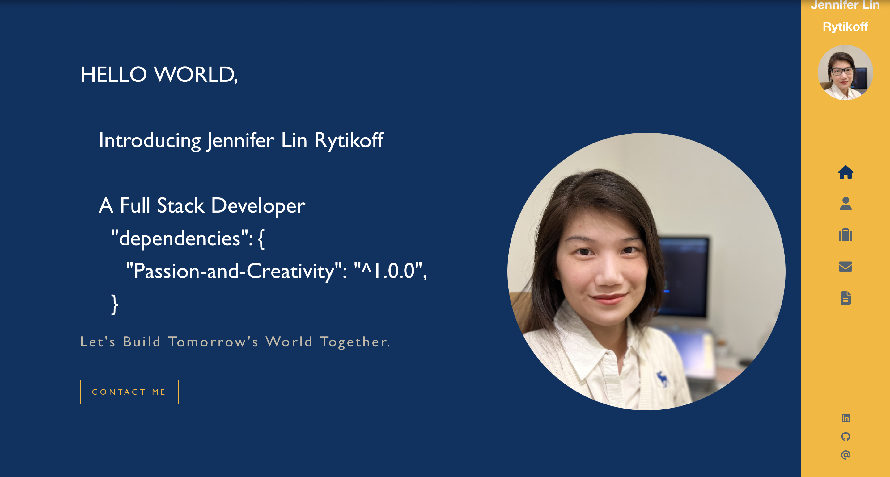

# Engineering the Future : Jennifer Rytikoff

## Description

Engineering the Future : Jennifer Rytikoff is a personal portfolio created using React. Welcome to my portfolio, where I showcase a collection of projects and introduce myself to visitors and potential future employers.   

In this portfolio, you'll find a diverse range of projects that demonstrate my expertise in both classic and modern frameworks. From responsive web applications to innovative solutions, each project reflects my commitment to building impactful and user-friendly experiences.  

Through this portfolio, I aim to share my passion for coding and problem-solving, connect with like-minded individuals, and explore exciting opportunities in the tech industry.  

I am thrilled to have you here. Let's embark on this journey together as we engineer the future and create meaningful solutions!  

## Table of Contents

- [Installation](#installation)
- [Usage](#usage)
- [Contributing](#contributing)
- [Tests](#tests)
- [License](#license)
- [Questions](#questions)

## Installation

No installaiton required.

## Usage

Welcome to my portfolio - [Engineering the Future : Jennifer Rytikoff](https://jenryt.github.io/EngineeringTheFuture/)

## License

This project is licensed under the MIT License - see the link for detail
https://opensource.org/license/mit/

## Credits

Special Thanks to freeCodeCamp.org for the [tutorial](https://www.youtube.com/watch?v=bmpI252DmiI) and for sharing [template code](https://github.com/bobangajicsm/react-portfolio-website.git) 
OpenAI 
[Formspree](https://formspree.io) 
License Badge created by shields.io 
License links provide by opensource.org 

## Tests

Currently, there is no test available.

- My GitHub: jenryt
- My email: bicodeture@gmail.com
